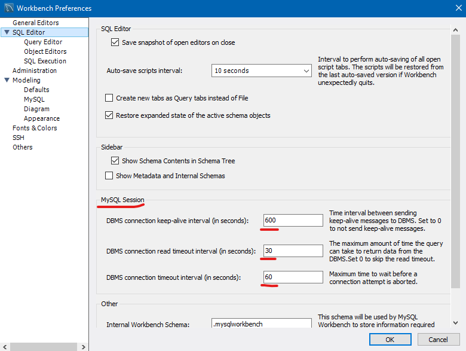

# MySQL

Estos son mis apuntes dentro del Taller Bases de Datos Relacionales SQL - MySQL de la ronda de capacitación 

- [MySQL](#mysql)
  - [Base de datos Relacionales (SQL)](#base-de-datos-relacionales-sql)
  - [Características](#características)
  - [Terminologías](#terminologías)
  - [Sentencias a conocer](#sentencias-a-conocer)
  - [Tutorial de MySQL](#tutorial-de-mysql)
  - [Proyecto](#proyecto)
    - [Diagrama Entidad Relación](#diagrama-entidad-relación)
  - [En código](#en-código)
    - [Utilizar una base de datos](#utilizar-una-base-de-datos)
    - [Read - Consultas](#read---consultas)
    - [Create - Crear](#create---crear)
      - [Crear tabla - CREATE TABLE](#crear-tabla---create-table)
      - [Insertar una fila de datos - INSERT INTO](#insertar-una-fila-de-datos---insert-into)
    - [Update - Modificar](#update---modificar)
    - [Delete - Eliminar](#delete---eliminar)
    - [Procedimientos](#procedimientos)
  - [Problemas](#problemas)
    - [Me salta error 2013: Lost connection to MySQL Server during query](#me-salta-error-2013-lost-connection-to-mysql-server-during-query)

## Base de datos Relacionales (SQL)

Se basan en establecer relaciones o vínculos entre los datos, imaginando una tabal aparte por cada relación existente con sus propios registros y atributos

1. Relacionales
2. Tablas
3. Esquemas

| Ventaja                                                                                                                   | Desventaja                                                                                                  |
|---------------------------------------------------------------------------------------------------------------------------|-------------------------------------------------------------------------------------------------------------|
| **Madurez**. Tienen gran cantidad de años en el mercado y existe mucha experiencia en su utilización.                     | **Cambios en la estructura**. Estructura rígida muy difícil de cambiar cuando cuenta con mucha información. |
| **Atomicidad**. La transacción se realiza al 100% o no se realzia ACID (Atomicity, Consistency, Isolation and Durability) | **Crecimiento**. Tienden a crecer demasiado haciendo que su mantenimiento sea difícil y costoso.            |
| **Estándares bien definidos**. SQL                                                                                        |                                                                                                             |
| **Sencillez en la escritura**. Se asemeja mucho al lenguaje humano                                                        |                                                                                                             |

## Características

1. Base de Datos Open Source para almacenar datos relacionados.
2. Utiliza el lenguaje SQL (Structured Query Lenguaje).
3. Una de las bases de datos más populares para crear sitios y aplicaciones web hoy en día.
4. Se utiliza desde sitios y aplicaciones pequeños hasta empresariales.
5. Utilziado con múltiples lenguaje (java, python, php).
6. Se puede conectar a aplicaciones web, móviles y de escritorio.
7. Disponible para Windows, Mac y Linux.
8. El código de SQL, se puede ejecutar desde una terminal, también desde una aplicación de escritorio o WEB

## Terminologías

1. Numéricos: INT, TINYINT, BIGINT, FLOAT
2. Cadenas/String: VARCHAR, TEXT, CHAR
3. Fecha y hora: DATE, DATETIME, TIME, TIMESTAMP
4. otros: BLOB o JSON

## Sentencias a conocer

1. Sentencias CRUD
   1. C -> Create
   2. R -> Reading
   3. U -> Updating
2. Sentencias CREATE PROCEDURE

## Tutorial de MySQL

[Tutorial de la página oficial](https://dev.mysql.com/doc/refman/8.0/en/tutorial.html)

## Proyecto

Este es un proyecto muy simple, solo consta de tres tablas.

### Diagrama Entidad Relación



## En código

En esta sección se verán las 4 sentencias CRUD: Create, Read, Update y Delete. Además de la sentencia CREATE PROCEDURA

### Utilizar una base de datos

En un solo proyecto se puede utilizar muchas bases de datos, por lo que existe la sentencia `use`. Esta sentencia le da un contexto de cuál base de datos se está refiriendo.

Ejemplo:

```sql
use bd_test;

select * from cliente;
```

Esta es una característica opcional ya que al referirse en una tabla se puede utilizar la síntaxis:

```sql
select * from bd_test.cliente;
```

Con fínes de compactación se utilizará en este tutorial el segundo método.

### Read - Consultas

```sql
select * from bd_test.cliente;
select * from bd_test.cliente;
select * from bd_test.cliente;
```

### Create - Crear

#### Crear tabla - CREATE TABLE

Se utiliza para crear una tabla

Se recomienda no utilizar llaves foreaneas ya que limita la escalabilidad de las tablas.

La síntaxis es:

CREATE TABLE [base de datos].[tabla] (
  [columna] [tipo de dato] [PALABRA RESERVADA],
  PRIMARY KEY ([columna])
)

Palabras reservadas son:

1. NULL -> Acepta valores vacíos
2. NOT NULL -> No acepta valores vacíos
3. AUTO_INCREMENT -> El valor es incremental

Ejemplos:

```sql
CREATE TABLE bd_test.cliente_RC (
  id_cliente int NOT NULL AUTO_INCREMENT,
  nombre varchar(200) NOT NULL,
  apellido varchar(200) NULL,
  cedula varchar(64) NOT NULL,
  sexo char(1) NULL,
  fecha_nacimiento date NOT NULL,
  PRIMARY KEY (id_cliente),
  UNIQUE INDEX idx_unique_cedula (cedula)
)
```

```sql
CREATE TABLE bd_test.hobbie_RC (
  id_hobbie int NOT NULL AUTO_INCREMENT,
  descripcion varchar(64) NOT NULL,
  PRIMARY KEY (id_hobbie)
)
```

```sql
CREATE TABLE bd_test.cliente_hobbie_RC (
  id_cliente int NOT NULL,
  id_hobbie int NOT NULL,
  PRIMARY KEY (id_cliente, id_hobbie)
)
```

#### Insertar una fila de datos - INSERT INTO

Se utiliza la sentencia INSERT INTO para insertar datos a la tabla.

Su síntaxis es:

INSERT INTO [base de datos].[tabla] ([columna],[columna]) values ([valores], [valores])

Ejemplos:

```sql
insert into bd_test.cliente (nombre,apellido,cedula,sexo,fecha_nacimiento) values ('Ricardo','Cuan','8-55-11','M','1976-01-10');
```

### Update - Modificar

Con esta sentencia podrás modificar elementos de una tabla.

Es altamente recomendable el uso de un where en la sentencia para que solo altere los datos deseados y no toda la tabla.

La síntaxis es: UPDATE [base de datos].[tabla] set [columna] = [nuevo valor] where [condición]

Ejemplo:

```sql
update bd_test.cliente set nombre = 'Ana Maria' where id_cliente = 1;

update bd_test.hobbie set descripcion = 'Aviones' where id_hobbie = 1;

```

### Delete - Eliminar

Se utiliza para eliminar datos de una tabla

Es altamente recomendable el uso de un where en la sentencia para que solo altere los datos deseados y no toda la tabla.

Eliminar una tabla

```sql
drop table bd_test.cliente;
```

Otra alternativa sería:

```sql
drop table if exists bd_test.cliente;
```

Eliminar una fila de datos

```sql
delete from bd_test.cliente where id_cliente = 1;
```

### Procedimientos

Son ejecuciones de código al realizar algún tipo de acción en la base de datos.

[Tutorial y explicación](https://manuales.guebs.com/mysql-5.0/stored-procedures.html#:~:text=Los%20procedimientos%20almacenados%20y%20funciones,pueden%20almacenarse%20en%20el%20servidor.)

```sql
use bd_test;
DELIMITER $$
CREATE PROCEDURE sp_clientes_ar (IN sexopersona char(1))
BEGIN
SELECT * FROM cliente WHERE sexo = sexopersona;
END $$
delimiter ;
CALL sp_clientes_am('M');
SHOW CREATE PROCEDURE sp_clientes_am;


set @o_return = 0;

/*Insertar un registro*/
call bd_test.sp_cliente('C1', 19000, 'Bruno', 'Díaz', '8-123-321', 'M', '1939-03-30', @o_return);

/*Consulta por id de cliente*/
call bd_test.sp_cliente('R1', 1000, null, null, null, null, null, @o_return);

/*Consulta por cédula*/
call bd_test.sp_cliente('R2', null, null, null, '8-789-132', null, null, @o_return);

/*Consulta 1000 registros*/
call bd_test.sp_cliente('R3', null, null, null, null, null, null, @o_return);

/*Actualiza Registro*/
call bd_test.sp_cliente('R1', 4000, null, null, null, null, null, @o_return); /*Verifico valores anteriores*/
call bd_test.sp_cliente('U1', 4000, 'Jacinto', 'Rodríguez', 'E-810-9478', 'M', '1981-01-12', @o_return); /*Actualizo valores*/
call bd_test.sp_cliente('R1', 4000, null, null, null, null, null, @o_return); /*Verifico nuevos valores*/

/*Agregar hobbies al cliente*/
CALL bd_test.sp_cliente_hobbie('C1',1000,3, null, @o_return);
CALL `bd_test`.`sp_consulta_cliente_hobbies`(1000);

/*select @o_return;*/
```

## Problemas

### Me salta error 2013: Lost connection to MySQL Server during query

**¿Por qué pasa?** Esto se debe a la alta creación de recursos dentro de la base de datos.

**Solución**: Aumentar el tiempo de espera de SQL a la hora de realizar una ejecución:

1. En MySQL Workbrench, dirigirse a Edit / Preferences / SQL Editor / MySQL Session
2. Aumentar el tiempo que posee los tres campos.


